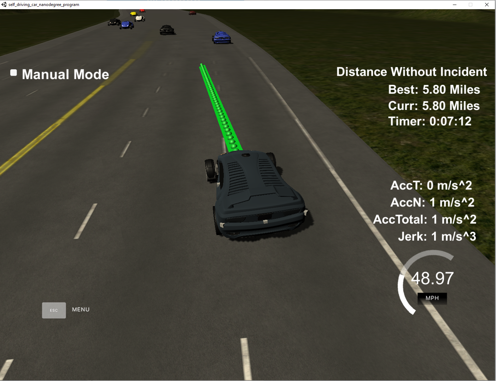

# Path Planning - Project Report

## Rubric Points:
### The code compiles correctly.
I've added the created sources to the `CMakeLists.txt` so the project should build without any issues.
### The car is able to drive at least 4.32 miles without incident.
Done.

### The car drives according to the speed limit.
To guarantee this, the Path Planner has an upper speed limit at 49 mph (see `Constants.MAX_SPEED`).
### Max Acceleration and Jerk are not Exceeded.
Maximum acceleration is limited to `Constants.MAX_ACCELERATION`. Additionally, speed change is further reduced during 
changing lanes (`PathPlanner.cpp:152`). To avoid Jerk, I've slightly changed spline config (`PathPlanner.cpp:126`)
to achieve a smoother path curve. 
### Car does not have collisions.
Checked.
### The car stays in its lane, except for the time between changing lanes.
For this I skipped creating a cost function. Instead, the Planner prefers the current lane if there are 
no cars ahead (see `PathPlanner.cpp:62`).
### The car is able to change lanes.
The algo tries to pick the "most free" lane ahead. Lanes are considered "blocked" if there is a vehicle too close to our
position in the road (`PathPlanner.cpp:41`). Worst case - there are cars ahead in all 3 lanes and the Path Planner 
tries to follow the car in our lane with matching speed.
### There is a reflection on how to generate paths.
First, the Path Planner receives the previous path and current car telemetry.
Using sensors data, the Planner calculates collision distances to cars in each lane, and having this info - 
decides which lane to take (`PathPlanner.cpp:36-75`).

If there is a car too close in the target lane (`PathPlanner.cpp:77-86`) - the Planner matches their velocity and allows 
using "brakes" - slightly faster deceleration. 

Having decided on the target lane, we generate a smooth transition curve to that lane using `spline` library
(`PathPlanner.cpp:120-135`). Having this curve, the Planner takes `N` points on it to complete the missing path points.
The points are picked with such interval, that acceleration and velocity do not exceed external constraints.
The algo allows changing only one lane at a time by design.

The final step is converting the generating points from the `Car` coordinate system to `World` coordinates. 

